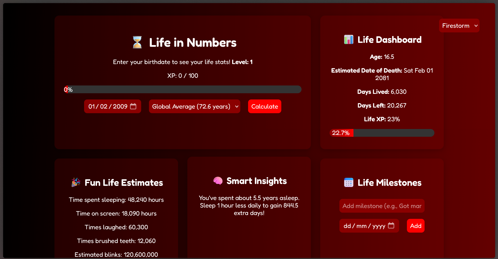

# Life in Numbers

**Your life, visualized.**  
Track every moment you've lived, earn XP, unlock badges, and gamify your existence.

## Features

### 🎯 Life Dashboard
- Track **age, days lived, days left, XP, and level** in a sleek interface.
- View animated **life progress bars** and fun estimates like time spent asleep or brushing teeth.
- Smart insights and world comparisons.
- Random motivational tooltips (e.g., *"Time’s ticking 🕰️ — go touch some grass."*).

### 🗓️ Milestones & Achievements
- Add milestones and achievements with emojis and animations.
- Unlock static achievements (like *"Still Alive!"* or *"10,000 days lived"*) and auto-sorted views.

### 🏅 XP, Levels & Badges
- Gain XP by completing tasks, unlocking milestones, and using features.
- Unlock **6 tiered badges** (🥈 to 🌟) in the Life XP Shop.
- Smooth animations and persistent storage.

### 📊 Daily Tasks, Challenges & Kindness
- Track daily health habits (sleep, hydration, smiles).
- Complete daily challenges or acts of kindness for big rewards.
- Visual feedback via charts and animations.

### ✅ To-Do List & History
- Gamified productivity with XP/Coin rewards.
- History log, smooth animations, and smart validation.

### ⏱️ Pomodoro Focus Timer
- Log sessions, track history, and earn rewards per session.
- View work stats with beautiful timers and logs.

### 🛍️ Life XP Shop
- Spend XP to unlock badges with progress and prerequisite system.

### 🎨 Themes
- Choose from 7 animated themes: Dark, Light, Matrix, Sunset, Emoji, Firestorm, Neon.
- Dynamic backgrounds and responsive design.

### 📜 Daily Quote
- Random motivational quotes with motivation!

## 📦 Tech Stack

- **HTML / CSS / JavaScript**
- **Chart.js** for radar charts
- **Howler.js** for sound
- **localStorage** for data persistence
